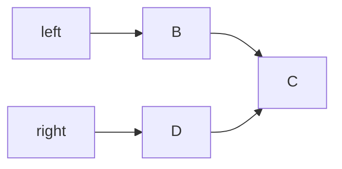
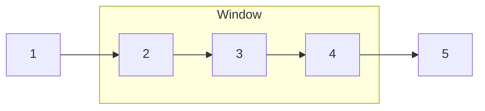
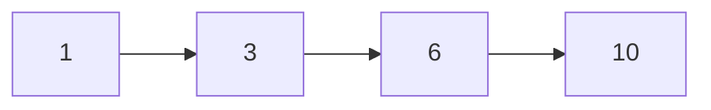
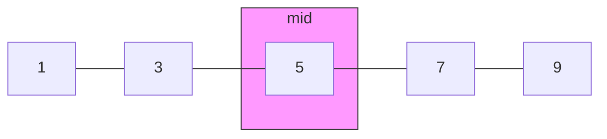
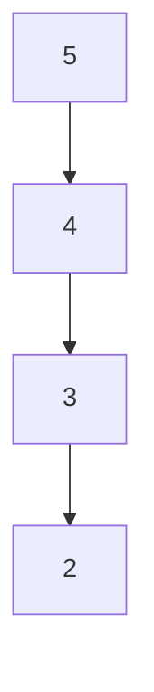
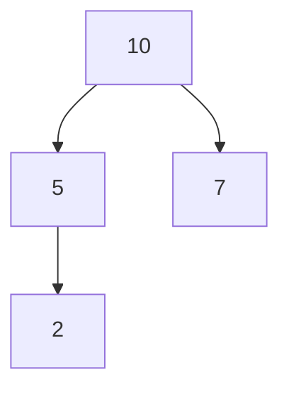
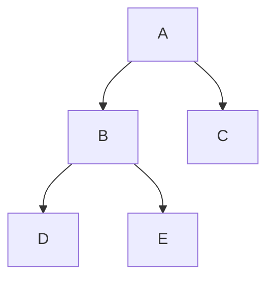
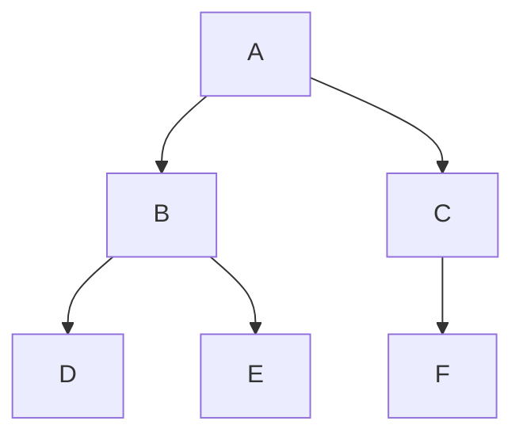
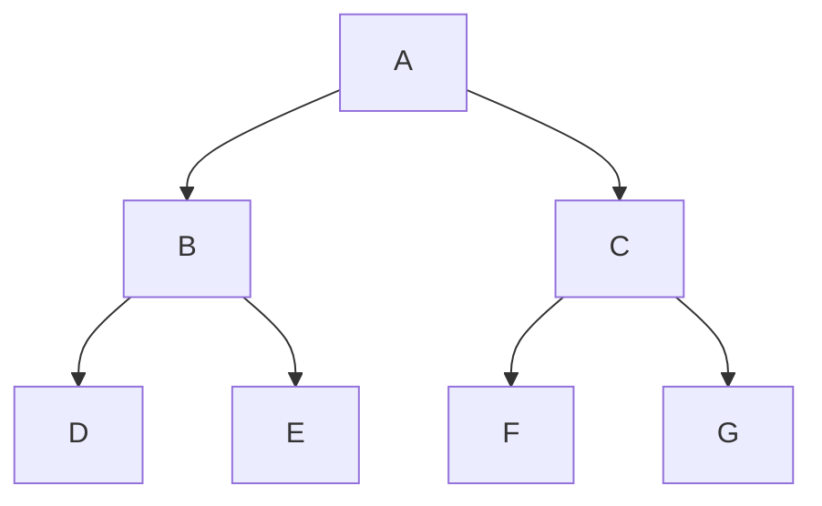
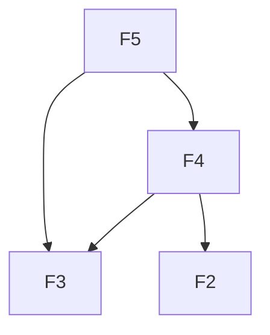

# Coding Interview Algorithm Templates

Este guia ensina **patterns de algoritmos** usados em entrevistas técnicas. Cada pattern inclui:

- Explicação simples
- Exemplo intuitivo
- **Diagrama visual**
- Problemas sugeridos do LeetCode

A ideia é memorizar o **esqueleto da solução** e adaptar rapidamente para cada problema.
Linguagem usada: **Python**.

# 1. Two Pointers

## Ideia

Dois ponteiros percorrem a estrutura ao mesmo tempo.
Usado quando precisamos comparar elementos de lados diferentes.

## Diagrama



Os ponteiros caminham um em direção ao outro.

## Exemplo

Verificar se uma string é palíndromo.

## LeetCode

- Two Sum II
- Valid Palindrome
- Container With Most Water

## Código

```python
def two_pointers(arr):
    left = 0
    right = len(arr) - 1

    while left < right:

        if condition:
            left += 1
        else:
            right -= 1
```

# 2. Sliding Window

## Ideia

Uma **janela móvel** percorre o array mantendo apenas parte dos
elementos. Usado para **subarrays ou substrings contínuas**.

## Diagrama



A janela desliza pelo array.

## LeetCode

- Longest Substring Without Repeating Characters
- Maximum Average Subarray

## Código

```python
def sliding_window(nums):
    left = 0
    window = 0
    result = 0

    for right in range(len(nums)):

        window += nums[right]

        while window > target:
            window -= nums[left]
            left += 1

        result = max(result, window)

    return result
```

# 3. Prefix Sum

## Ideia

Pré-calcular somas acumuladas. Permite calcular soma de intervalos rapidamente.

## Diagrama



Cada posição contém a soma de todos os anteriores.

## LeetCode

- Range Sum Query
- Subarray Sum Equals K

## Código

```python
def prefix_sum(nums):

    prefix = [0] * (len(nums) + 1)

    for i in range(len(nums)):
        prefix[i+1] = prefix[i] + nums[i]

    return prefix
```

Consulta de intervalo:

```python
def range_sum(prefix, left, right):
    return prefix[right+1] - prefix[left]
```

# 4. Binary Search

## Ideia

Divide o espaço de busca pela metade.

## Diagrama



Sempre verifica o **meio**.

## LeetCode

- Binary Search
- Search in Rotated Sorted Array

## Código

```python
def binary_search(nums, target):

    left = 0
    right = len(nums) - 1

    while left <= right:

        mid = (left + right) // 2

        if nums[mid] == target:
            return mid

        if nums[mid] < target:
            left = mid + 1
        else:
            right = mid - 1

    return -1
```

# 5. Monotonic Stack

## Ideia

Stack que mantém **ordem crescente ou decrescente**. Usado em problemas como **Next Greater Element**.

## Diagrama



Sempre mantém ordem.

## LeetCode

- Daily Temperatures
- Next Greater Element

## Código

```python
def monotonic_stack(nums):

    stack = []
    result = [-1] * len(nums)

    for i in range(len(nums)):

        while stack and nums[i] > nums[stack[-1]]:

            index = stack.pop()
            result[index] = nums[i]

        stack.append(i)

    return result
```

# 6. Heap / Priority Queue

## Ideia

Estrutura para encontrar rapidamente **maior ou menor elemento**.

## Diagrama



Estrutura de **heap binário**.

## LeetCode

- Top K Frequent Elements
- K Closest Points to Origin

## Código

```python
import heapq

def top_k(nums, k):

    heap = []

    for num in nums:

        heapq.heappush(heap, num)

        if len(heap) > k:
            heapq.heappop(heap)

    return heap
```

# 7. DFS (Depth First Search)

## Ideia

Explora profundamente antes de voltar. Usado para árvores ou grafos.

## Diagrama



DFS segue um caminho até o final.

## LeetCode

- Number of Islands
- Clone Graph

## Código

```python
def dfs(node, visited):

    if node in visited:
        return

    visited.add(node)

    for neighbor in node.neighbors:
        dfs(neighbor, visited)
```

# 8. BFS (Breadth First Search)

## Ideia

Explora nível por nível.

## Diagrama



BFS usa **fila**.

## LeetCode

- Binary Tree Level Order Traversal
- Rotting Oranges

## Código

```python
from collections import deque

def bfs(start):

    queue = deque([start])
    visited = set([start])

    while queue:

        node = queue.popleft()

        for neighbor in node.neighbors:

            if neighbor not in visited:

                visited.add(neighbor)
                queue.append(neighbor)
```

# 9. Matrix / Grid Traversal

## Ideia

Percorrer uma matriz.

## Diagrama

    [0,0] [0,1] [0,2]
    [1,0] [1,1] [1,2]
    [2,0] [2,1] [2,2]

## LeetCode

- Number of Islands
- Flood Fill

## Código

```python
def dfs_grid(grid, r, c):

    if r < 0 or c < 0 or r >= len(grid) or c >= len(grid[0]):
        return

    if grid[r][c] == 0:
        return

    grid[r][c] = 0

    dfs_grid(grid, r+1, c)
    dfs_grid(grid, r-1, c)
    dfs_grid(grid, r, c+1)
    dfs_grid(grid, r, c-1)
```

# 10. Backtracking

## Ideia

Explorar todas as possibilidades. Usado para gerar combinações.

## Diagrama



Árvore de decisões.

## LeetCode

- Permutations
- Combination Sum
- N Queens

## Código

```python
def backtrack(path, choices):

    if is_solution(path):
        result.append(path[:])
        return

    for choice in choices:

        path.append(choice)

        backtrack(path, choices)

        path.pop()
```

# Dynamic Programming Templates

# 11. Fibonacci / Linear DP

## Diagrama



## LeetCode

- Climbing Stairs
- House Robber

## Código

```python
def fibonacci(n):

    if n <= 1:
        return n

    dp = [0] * (n + 1)

    dp[1] = 1

    for i in range(2, n+1):
        dp[i] = dp[i-1] + dp[i-2]

    return dp[n]
```

# 12. Kadane Algorithm

Encontrar **máximo subarray**.

## Diagrama

    -2 1 -3 4 -1 2 1 -5 4
             [4 -1 2 1]

## LeetCode

- Maximum Subarray

## Código

```python
def kadane(nums):

    current = nums[0]
    best = nums[0]

    for n in nums[1:]:
        current = max(n, current + n)
        best = max(best, current)

    return best
```

# 13. 0/1 Knapsack

Escolher itens com limite de peso.

## Diagrama

    item | peso | valor
    A    | 2    | 6
    B    | 2    | 10
    C    | 3    | 12

## Código

```python
def knapsack(weights, values, capacity):

    n = len(weights)

    dp = [[0]*(capacity+1) for _ in range(n+1)]

    for i in range(1, n+1):
        for w in range(capacity+1):

            if weights[i-1] <= w:

                dp[i][w] = max(
                    values[i-1] + dp[i-1][w-weights[i-1]],
                    dp[i-1][w]
                )

            else:
                dp[i][w] = dp[i-1][w]

    return dp[n][capacity]
```

# 14. Longest Common Subsequence

Maior subsequência comum.

    ABCBDAB
    BDCAB

## Código

```python
def lcs(a, b):

    m = len(a)
    n = len(b)

    dp = [[0]*(n+1) for _ in range(m+1)]

    for i in range(1, m+1):
        for j in range(1, n+1):

            if a[i-1] == b[j-1]:
                dp[i][j] = 1 + dp[i-1][j-1]
            else:
                dp[i][j] = max(dp[i-1][j], dp[i][j-1])

    return dp[m][n]
```

# 15. Longest Increasing Subsequence

Sequência crescente.

    10 9 2 5 3 7 101
           ↑

```python
import bisect

def lis(nums):

    sub = []

    for x in nums:

        i = bisect.bisect_left(sub, x)

        if i == len(sub):
            sub.append(x)
        else:
            sub[i] = x

    return len(sub)
```

# 16. DP on Grid

```python
def unique_paths(m, n):

    dp = [[1]*n for _ in range(m)]

    for i in range(1, m):
        for j in range(1, n):

            dp[i][j] = dp[i-1][j] + dp[i][j-1]

    return dp[m-1][n-1]
```

# Como usar estes templates

Durante entrevistas:

1.  Identifique o **pattern do problema**
2.  Escreva o **template base**
3.  Adapte as condições do problema

Treinar esses templates reduz muito o tempo de solução.
